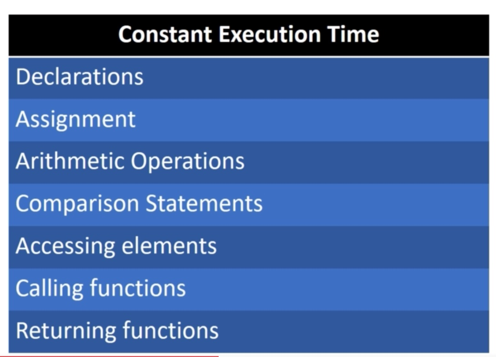
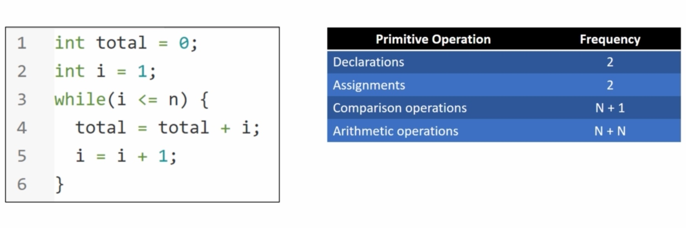

# Notes

Measuring "goodness" of an algorithm or a data structure

Two techniques we use as tools to measure an algorithm is time complexity and space complexity

- Time complexity is the amount of time taken by an algorithm to execute
- Space complexity is the amount of memory used by the algorithm while executing

---

There are two ways of analyzing the algorithms for performance with respect to the running time or time complexity.... Experiemental Analysis and Theoretical Analysis

**_Experimental Analysis_**
1. Run time mesasured on various inputs
2. Programming languages provides time function
3. Lapse time is computed

Disadvantages
1. Limited input
2. Hardware dependent
3. Software dependent
4. Operating system dependent

**_Theoretical Analysis_**
1. Performed on desciption of Algorithm
2. Independent of hardware and software
3. All possible inputs, e.g.
 and 

