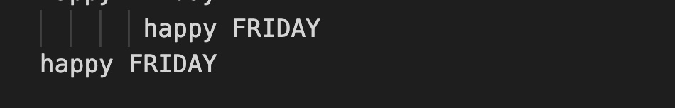
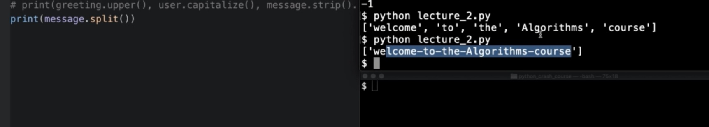
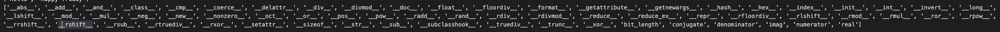
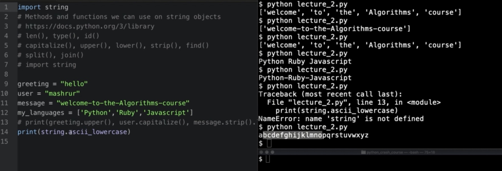

# Notes

You can run an interactive python shell in your terminal by typing in the command `python`, `ctrl+D` allows you to quit

---

## Slicing


`name = "INTERSTELLAR"`

```
name = I N T E R S T E L  L A  R
       0 1 2 3 4 5 6 7 8  9 10 11
                      -4 -3 -2 -1
```
`print(name[0:5])` would print `INTER`

we have to include 5 because by default the first index will not be included

if we wanted STELLAR instead, S starts at 5, so we'll start with 5 as the start value

`print(name[5:])` would print out `STELLAR`

name[5:] 
+1 towards the end of the string doesn't exist, so we can leave the stop slot empty


step size is one by default


---

## String Functions 
[Link to read more]('https://docs.python.org/3/library/functions.html')

- len()
will also count white spaces, e.g.

greeting = "hello"
user="jr"
message="happy friday"
age=20

`print(len(greeting)) //prints 5`
`print(len(message)) //prints 12`

- type()
type will tell you the type

`print(type(age)) //prints int`
`print(type(user)) //prints str`

- id()


~
- capitalize()
you have to include dots when using capitalize, e.g.

greeting = "hello"
user="jr"
message="happy friday"
age=20

`print(greeting.capitalize(), message.capitalize()) //prints "Hello", "Happy friday"`


- upper()
will capitalize your entire string

greeting = "hello"
user="jr"
message="happy FRIDAY"

`print(user.upper())`
prints JR
`print(message.upper())`
prints HAPPY FRIDAY

- lower()
will lowercase your entire string

greeting = "hello"
user="jr"
message="happy FRIDAY"

`print(user.lower())`
prints jr
`print(message.lower())`
prints happy friday


- strip()
removes whitespaces from characters before and after a string, e.g.
```
message1="       happy FRIDAY       "
```

`print(message1) # prints "       happy FRIDAY       "`
`print(message1.strip()) # prints happy FRIDAY`



- find()
`message2 = "guess what day it is!? it's happy FRIDAY"`
`print(message2.find('it')) # will print 15 because it found 'it' on index 15`

** if you're looking for a character that doesn't exist, e.g. 'z' i'll get a -1
`print(message2.find('z')) # will print -1`

~

- split()
will print every word into it's own string separated by commas also viewed as a list data structure, e.g.
`print(message2.split())` will return
`['guess', 'what', 'day', 'it', 'is!?', "it's", 'happy', 'FRIDAY']`

** if there's no spaces e.g. just one long string separated by - then you'll get one long string in return e.g.


** what you can do in that case, is specify to split on the dash e.g.

`message3="guess-what-day-it-is!?-it's-happy-FRIDAY-!"`
`print(message3.split("-")) # will print ['guess', 'what', 'day', 'it', 'is!?', "it's", 'happy', 'FRIDAY', '!']`

~

- join()
will put lists into one string, specify what will be the glue, our example it's space e.g. (" ") then .join followed by the iterable or variable name e.g. print(" ".join(message4))

`message4 = ['guess','what','day','it','is!?',"it's",'happy','FRIDAY','!','!']`
`print(" ".join(message4)) # guess what day it is!? it's happy FRIDAY ! !`

`message5 = ['python','ruby','javascript']`

`print(" ".join(message5)) # python ruby javascript`

** you can join with dashes e.g.
`print("-".join(message4)) # will print guess-what-day-it-is!?-it's-happy-FRIDAY-!-!`

~

** You can tell a function vs method by functions being written first like the above as examples

** methods are tied to the objects themselves

** you can have python display all of the built string objects by `print(dir(varname))` e.g. `print(dir(user))`


** method chaining, is you can chain methods onto one another e.g.

```
message1="       happy FRIDAY       "
```

`print(message1.strip().lower()) # prints happy friday`

~

- import string
on top of the page write `import string` which will give you access to a bunch of import strings you can use, without the initial import string you'll get errors



import strings imports  all of the constants, so if you just wanted the ascii_lowercase, you would replace `import strings` with `from string import ascii_lowercase`

and you don't have to reference the string. in `print(string.ascii_lowercase)` it would just be `print(ascii_lowercase)`

---


