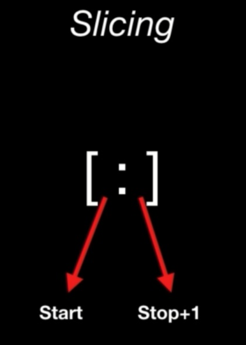
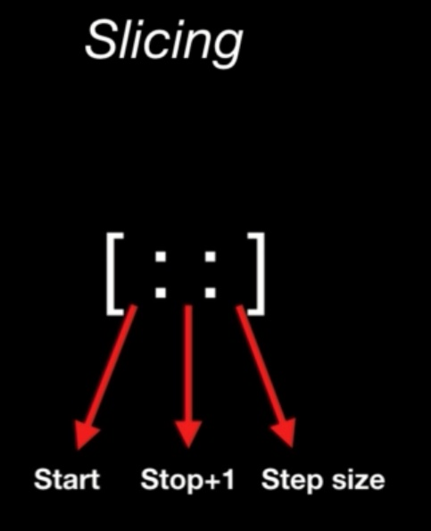
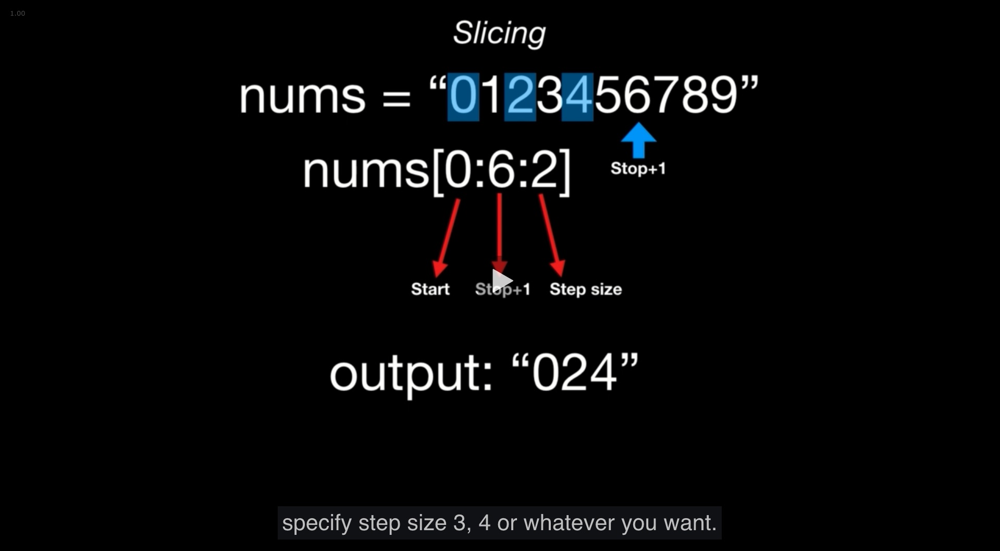
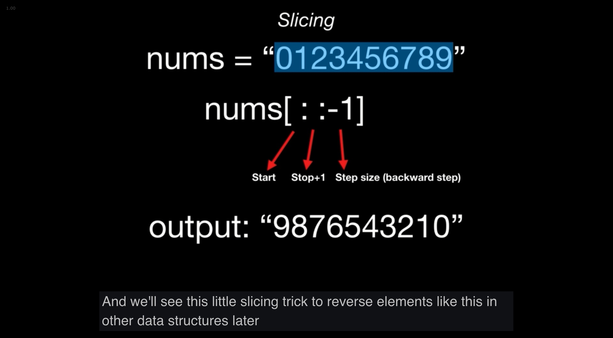

# Notes

You can run an interactive python shell in your terminal by typing in the command `python`, `ctrl+D` allows you to quit

---

## Slicing



`name = "INTERSTELLAR"`

```
name = I N T E R S T E L  L A  R
       0 1 2 3 4 5 6 7 8  9 10 11
                      -4 -3 -2 -1
```
`print(name[0:5])` would print `INTER`

we have to include 5 because by default the first index will not be included

if we wanted STELLAR instead, S starts at 5, so we'll start with 5 as the start value

`print(name[5:])` would print out `STELLAR`

name[5:] 
+1 towards the end of the string doesn't exist, so we can leave the stop slot empty






step size is one by default

